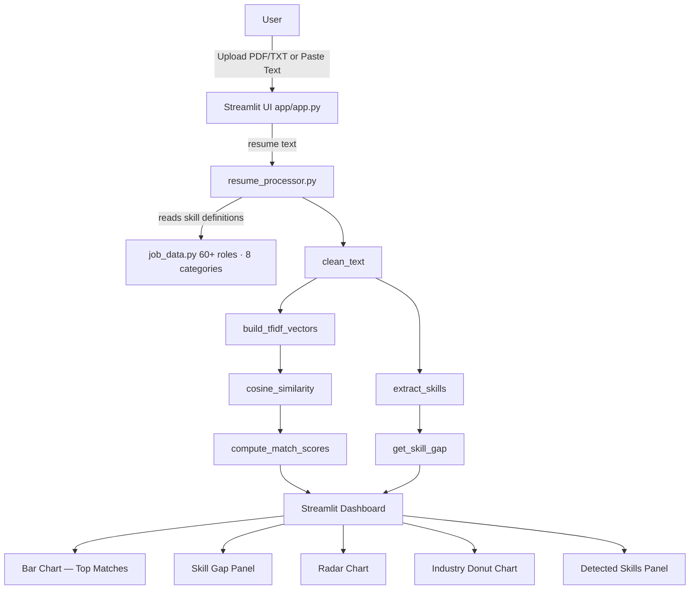
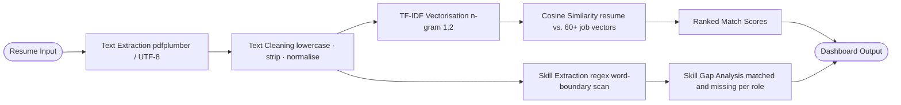
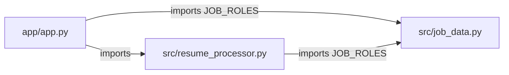

# Architecture & Workflow Diagrams

## System Architecture



## Processing Workflow



## Module Dependency



## Folder Structure

```
AI-Resume-Screener-and-Job-Recommender/
│
├── app/
│   └── app.py
├── src/
│   ├── resume_processor.py
│   └── job_data.py
├── assets/
│   ├── screenshots/
│   └── diagrams/
├── sample_resumes/
├── docs/
│   └── architecture.md
├── requirements.txt
├── README.md
├── LICENSE
├── CONTRIBUTING.md
├── CODE_OF_CONDUCT.md
├── CHANGELOG.md
└── .gitignore
```